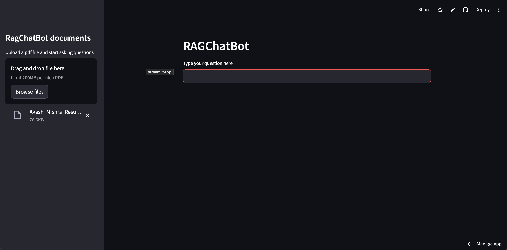

# 📄 RAG Chatbot (PDF)

A simple Retrieval-Augmented Generation (RAG) chatbot using Streamlit, LangChain, and OpenAI.

## 🌐 Live Demo

## 🚀 Features
- Upload PDF
- Ask questions from document
- Uses FAISS for vector search
- Uses OpenAI embeddings + LLM

## 🛠️ Tech Stack
- Python
- Streamlit
- LangChain
- OpenAI
- FAISS

## ⚙️ Setup

1. Clone repo:

## 📸 Demo

